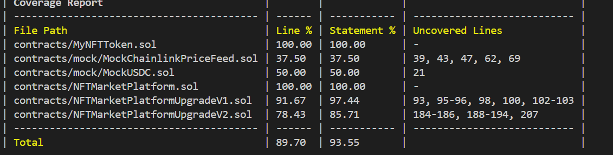

# 项目初始化

## 初始化npm环境

```shell
npm init -y
```

## 安装hardhat

```shell
npm install --save-dev hardhat@latest
```

## 初始化hardhat

```shell
npx hardhat --init
```

## 单元测试

```shell
npx hardhat test test/MyNFTToken.ts --coverage  

# --coverage 测试覆盖率报告
# --grep xxx 只测试某一个describe
```

## 本地部署

```shell
# 启动本地节点
npx hardhat node

# 部署到指定网络
npx hardhat run scripts/deployNFTToken.ts --network localhost

npx hardhat run scripts/deployMockUsdc.ts --network localhost
```

## 单元测试报告



## 目录结构

```
├── README.md                               说明
├── contracts                               
│   ├── MyNFTToken.sol                      NFT合约
│   ├── NFTMarketPlatform.sol               不带升级功能的拍卖平台
│   ├── NFTMarketPlatformUpgradeV1.sol      可升级的第一版拍卖平台合约
│   ├── NFTMarketPlatformUpgradeV2.sol      可升级的第二版拍卖平台合约
│   ├── NFTMarketProxy.sol                  uups代理合约
│   └── mock
│       ├── MockChainlinkPriceFeed.sol      chainlink mock
│       └── MockUSDC.sol                    ethusdc mock
├── hardhat.config.ts                       配置文件
├── ignition                        
│   └── modules
│       └── Counter.ts
├── image
│   └── image-1.png
├── package-lock.json
├── package.json
├── scripts
│   ├── deployChainlinkPriceFeed.ts         部署脚本：本地部署用的mock
│   ├── deployMockUsdc.ts                   部署脚本：本地部署用的mock
│   ├── deployNFTMarketPlatformUpgradeV1.ts 部署脚本：拍卖平台v1版本
│   ├── deployNFTMarketPlatformUpgradeV2.ts 部署脚本：可不用执行，后面升级部署中带了
│   ├── deployNFTMarketProxyToV1.ts         部署脚本：部署代理合约
│   ├── deployNFTMarketProxyUpToV2.ts       部署脚本：升级逻辑合约
│   ├── deployNFTToken.ts                   部署脚本：部署NFT合约
│   └── send-op-tx.ts                       默认示例
├── test
│   ├── MyNFTToken.ts                       测试：测试NFT
│   ├── NFTMarketPlatform.ts                测试：测试非升级功能的平台
│   ├── NFTMarketPlatformUpgradeV1.ts       测试：测试升级功能的平台V1版本
│   └── NFTMarketPlatformUpgradeV2.ts       测试：测试升级功能的平台v2版本
└── tsconfig.json
```