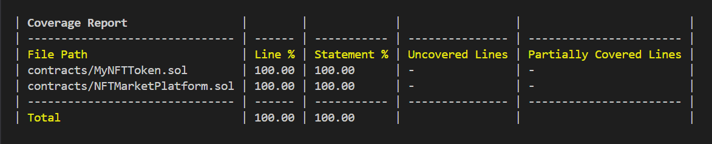

# 项目初始化

## 初始化npm环境

```shell
npm init -y
```

## 安装hardhat

```shell
npm install --save-dev hardhat@latest
```

## 初始化hardhat

```shell
npx hardhat --init
```

## 单元测试
```shell
npx hardhat test test/MyNFTToken.ts --coverage  

# --coverage 测试覆盖率报告
# --grep xxx 只测试某一个describe
```

## 单元测试报告

